# Integrating existing SaaS API with Broker connection in Fuse Online

## Prerequisites
* A valid [Fuse Online](https://www.redhat.com/en/explore/fuse-online) account 
* Finished the simple SaaS integration with Swagger Document [demo](https://github.com/weimeilin79/fuse7tp3demo/blob/master/README.md) 

## Background

Utility payment management system has offered an online service to pay for the water utility bill -- Water Company. You job is kick off a payment whenever an event is sent to the default message broker. 
 

The **Water Company** API has a backend dashboard that display all the payment. You will be able to view the result of the payment. 
(Data cleans every three hours.)

> https://water-company-tp3demo.4b63.pro-ap-southeast-2.openshiftapps.com/main

OpenShift managment Console is avaliable at:

> https://console.fuse-ignite.openshift.com/console/

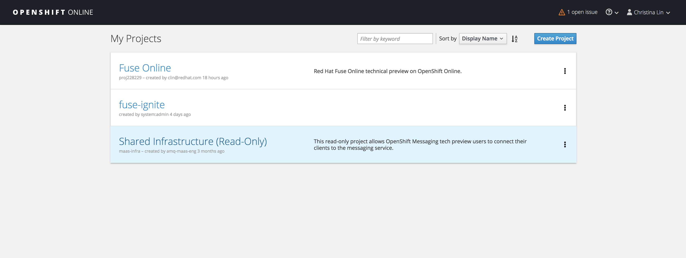

## Low Code Integration

### Step One - Start and configure AMQ broker

Before we start integration, let's start the default broker. Go to the OpenShift managment Console. And select projecxt on *Fuse Online*

> https://console.fuse-ignite.openshift.com/console/

Scale up **broker-amq** from 0 to 1 located at the buttom of the overview.

Once started, click on the running pod.

Go to AMQ console by click on the *Open Java Console*

Click on +Create on the tab panel
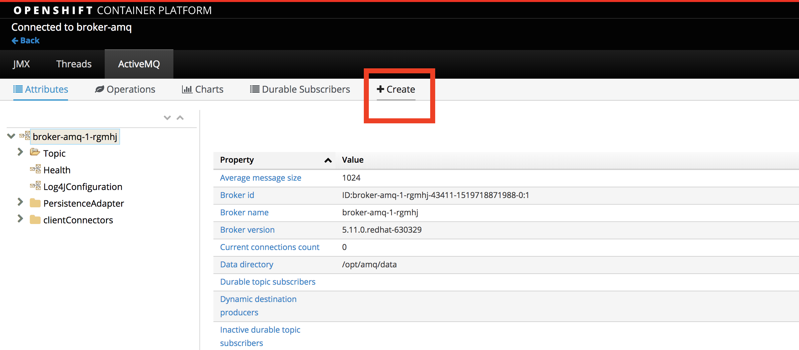

Enter 
> **Queue name:** paymentevent
> 
> **Destination Type:** Queue
 

On the lefthand panel, select Queue with name paymentevent and click **+Send** on the top tab panel. and set the credentail of the sender by clicking on **Preference** .

Start config
> **Activemq user name:** amq
> 
> **Activemq password:** topSecret
And click done on the left panel.

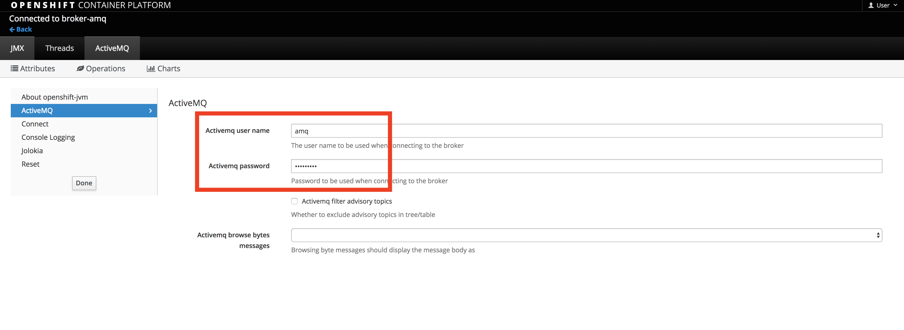

Go back to the Ignite console. in navigation panel, click Connections, and click on *Create Connection*

Selects "AMQ" as the Connection Type.
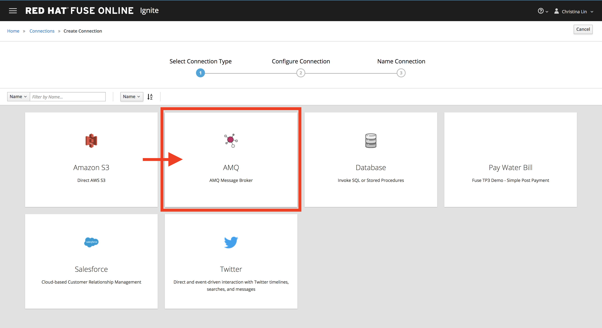

Enter

> **Base URL:** tcp://broker-amq-tcp:61616
> 
> **User Name:** amq
> 
> **Password**: topSecret

and select *"Next"*

Click on validate.

Name your connection.
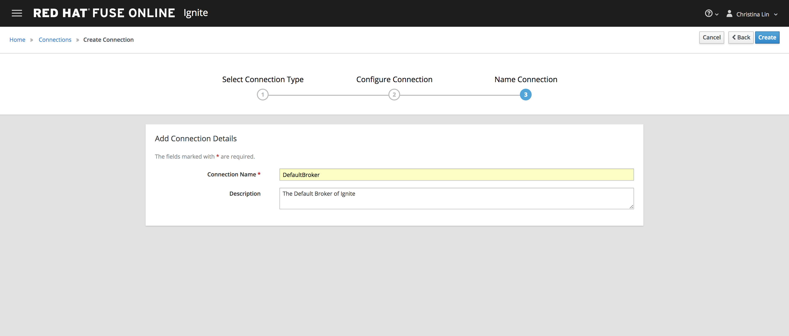

### Step Two - Integration

In the Ignite navigation panel, click Integrations, and click on *Create Integration*

On the Choose a Start Connection page, click the default DefaultBroker connection.

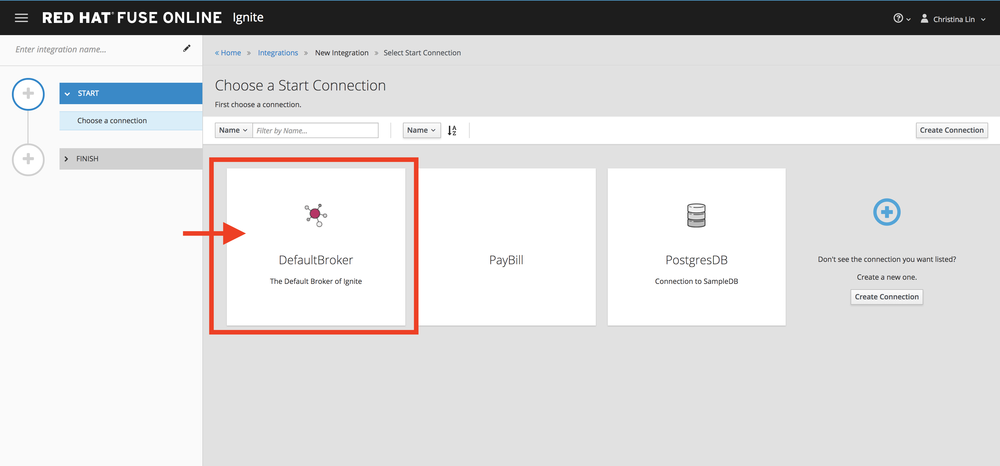

Choose *Subscribe for message* to listent to events send to broker.

Enter following input. 

* **Destination Name:** *paymentevent*
* **Destination Type:** *Queue*

On the Choose a Finish Connection page, click **PayBill** connection that you created.

On the Choose an Action page, click **Payment**, which will kick off water utility bill payment.

In the left panel, hover over the plus sign between the TODO *PERIODIC SQL INVOCATION* step and the finish *PAYMENT* connection to display a pop-up in which you click Add a Step.

On the Choose a Step page, click Data Mapper. 
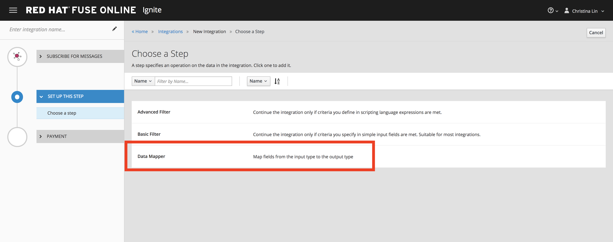

In the data mapper, the Sources panel on the left displays the fields in the output from the Todo step. The Target panel on the right displays the fields from the Water Company API. In the Target panel, expand the body field. click on the '+ ' sign in Constant. 

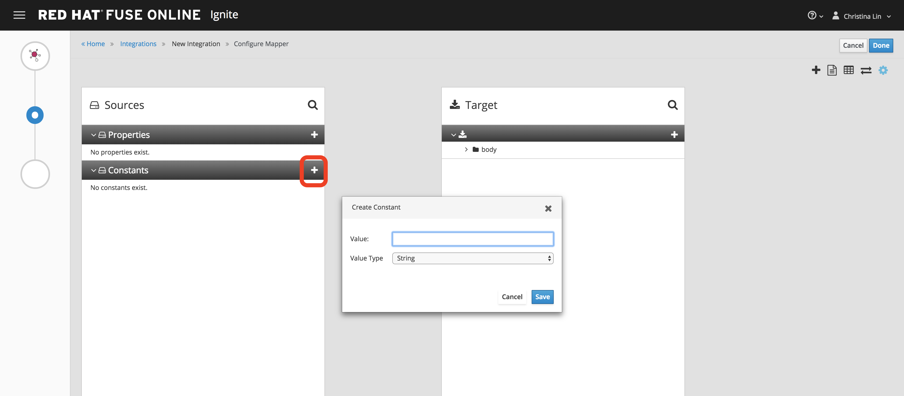

Create two constant

* **50:** *String*
* **YOUR_NAME:** *String*

Map your contant from Source panel to Target accordingly

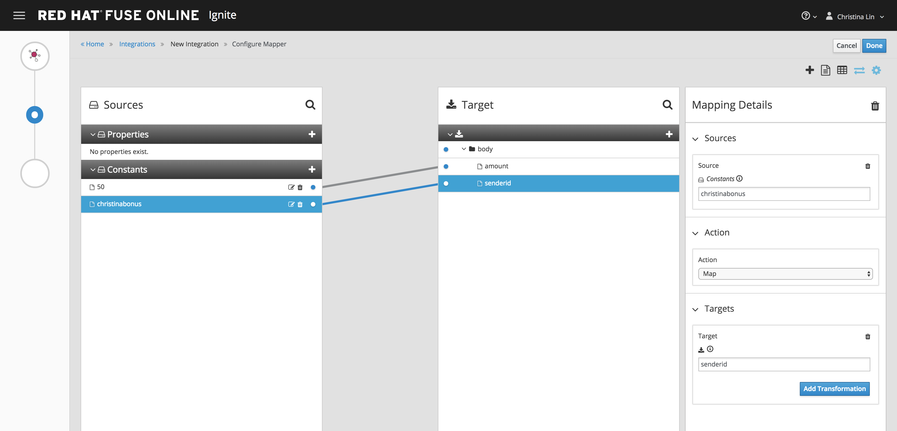

Name your integration and click publish.

### Step Three - Integration Result

Go back to your AMQ cosole, enter pay in the payload and click send message.

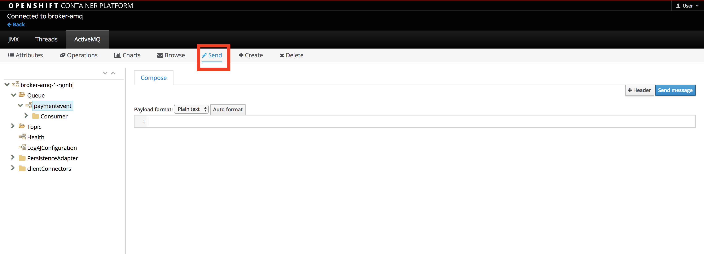
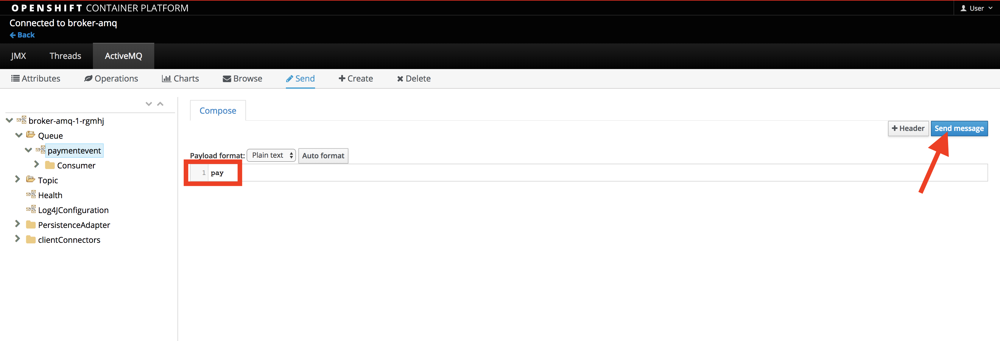

Go to the *Water Company* backend dashboard and view the result of the integration. 
> https://water-company-tp3demo.4b63.pro-ap-southeast-2.openshiftapps.com/main
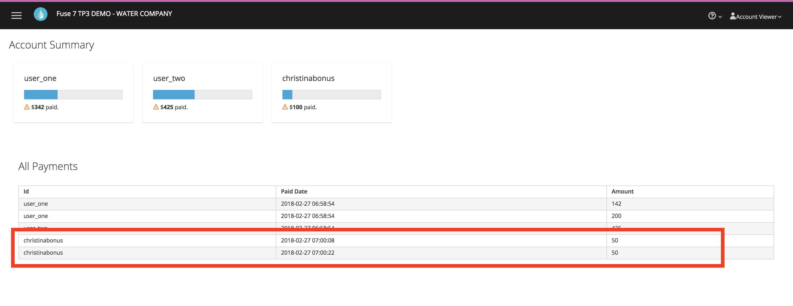

## Resource
[Fuse Online] (https://www.redhat.com/en/explore/fuse-online) - https://www.redhat.com/en/explore/fuse-online
[Demo Video](https://vimeo.com/257550267) - https://vimeo.com/257550267
[Demo Video](https://vimeo.com/257656566) - https://vimeo.com/257656566